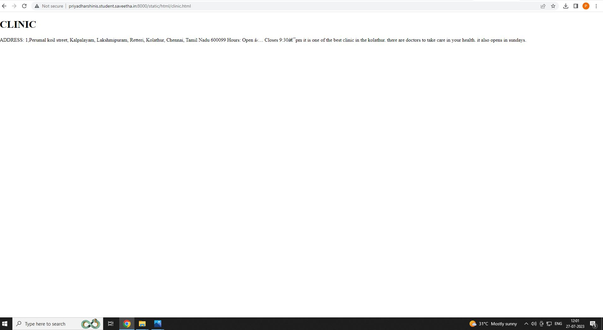
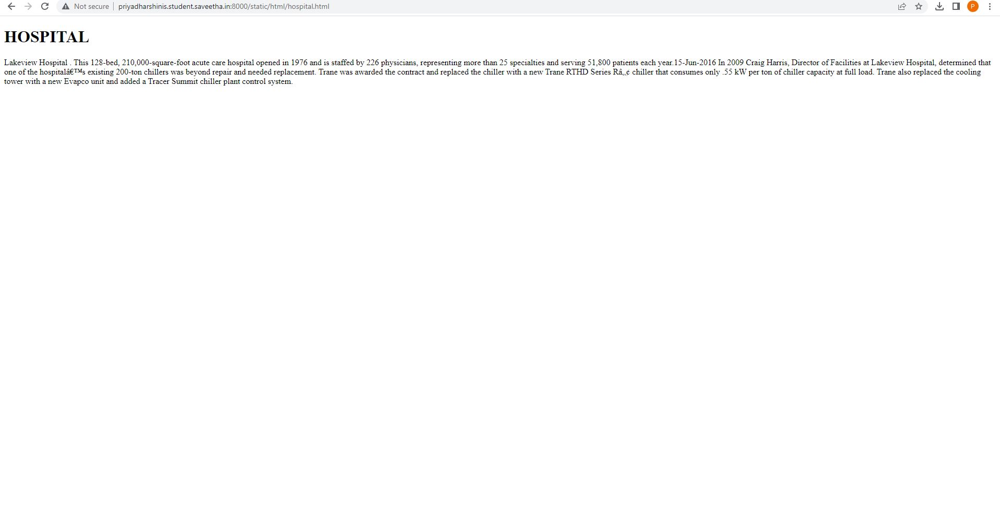
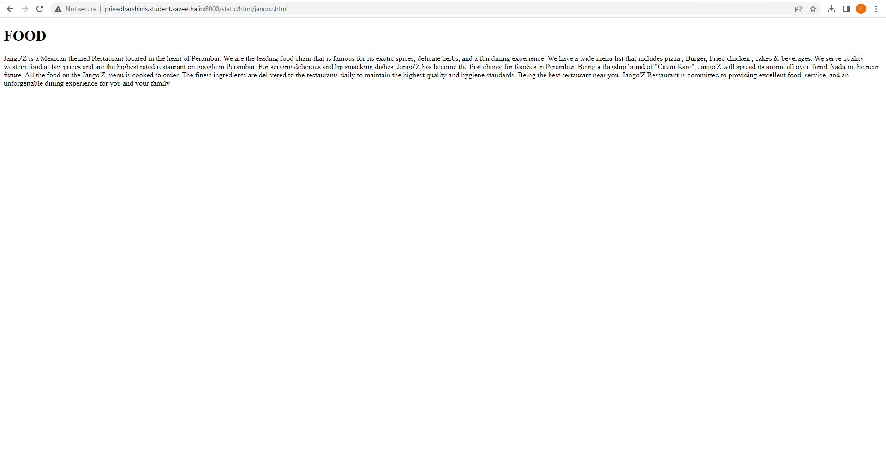
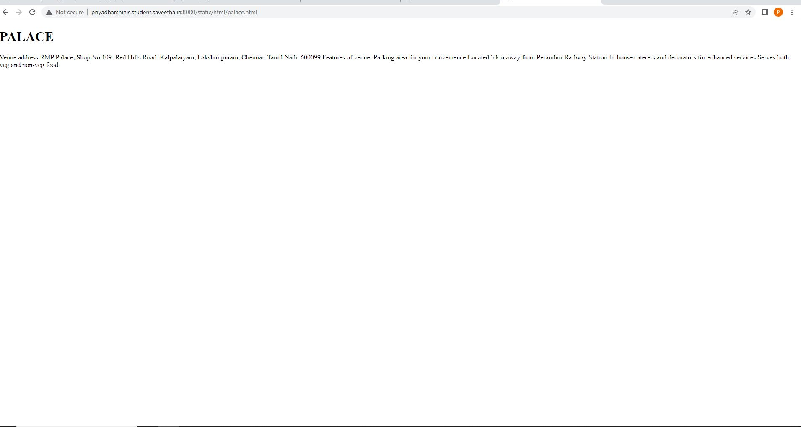
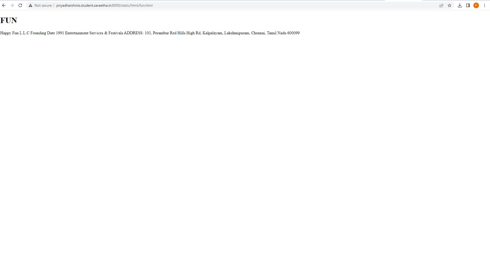
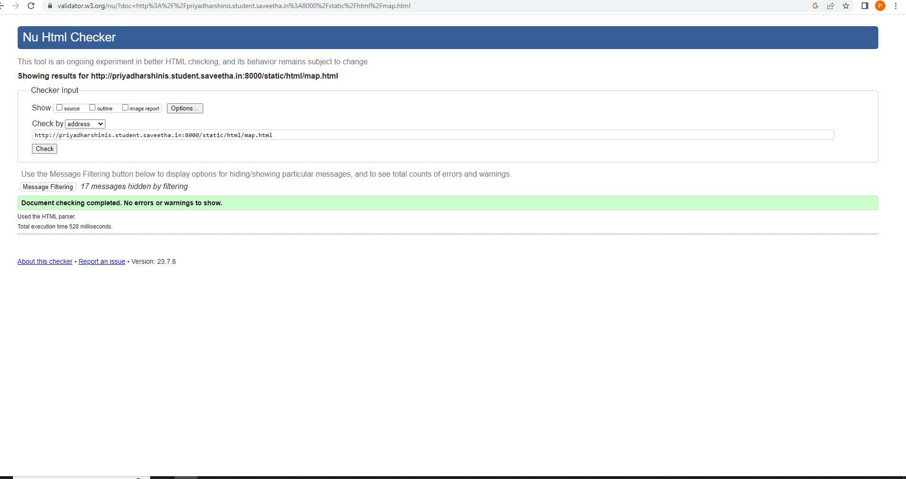

# Ex04 Places Around Me
## AIM
To develop a website to display details about the places around my house.

## DESIGN STEPS

### Step 1:
upload the html text of the placesaround .
### Step 2:
now run the server and take the screenshot of the outputs.

## CODE
```
<!DOCTYPE html>
<html>
     <head>
            <tittle>places-around-me</tittle>
     </head>

<body>


<map name="image-maps-2023-07-27-054934" id="ImageMapsCom-image-maps-2023-07-27-054934">
<area  alt="" title="jangoz" href="/static/html/jangoz.html" shape="rect" coords="752,458,837,515" style="outline:none;" target="_self"     />
<area  alt="" title="fun" href="/static/html/fun.html" shape="rect" coords="720,516,805,573" style="outline:none;" target="_self"     />
<area  alt="" title="hospital" href="/static/html/hospital.html" shape="rect" coords="1060,177,1145,234" style="outline:none;" target="_self"     />
<area  alt="" title="palace" href="/static/html/palace.html" shape="rect" coords="796,614,881,671" style="outline:none;" target="_self"     />
<area  alt="" title="clinic" href="/static/html/clinic.html" shape="rect" coords="399,323,484,380" style="outline:none;" target="_self"     />
<area shape="rect" coords="1918,951,1920,953" alt="Image Map" style="outline:none;" title="Image Map" href="https://www.image-maps.com/" />
</map>


</body>
</html> 

## clinic.html:

<!DOCTYPE html>
<html>
<head>
    <title>GIFTCLINIC</title>
</head>
<body>
    <h1>CLINIC</h1>
<p>
   ADDRESS: 1,Perumal koil street, Kalpalayam, Lakshmipuram, Retteri, Kolathur, Chennai, Tamil Nadu 600099
Hours: Open ⋅ Closes 9:30 pm
it is one of the best clinic in the kolathur.
there are doctors to take care in your health.
it also opens in sundays.
</p>
</body>
</html>

## fun.html:

<!DOCTYPE html>
<html>
<head>
    <title>HAPPYNFUN</title>
</head>
<body>
    <h1>FUN</h1>
<p>
   Happy Fun L.L.C
   Founding Date 1991
   Entertainment Services & Festivals
   ADDRESS: 103, Perambur Red Hills High Rd, Kalpalayam, Lakshmipuram, Chennai, Tamil Nadu 600099
</p>
</body>
</html>

## hospital.html:

<!DOCTYPE html>
<html>
<head>
    <title>LAKEVIEWHOSPITAL</title>
</head>
<body>
    <h1>HOSPITAL</h1>
<p>
   Lakeview Hospital .
This 128-bed, 210,000-square-foot acute care hospital opened in 1976 and is staffed by 226 physicians, representing more than 25 specialties and serving 51,800 patients each year.15-Jun-2016
In 2009 Craig Harris, Director of Facilities at Lakeview Hospital, determined that one of the hospital’s existing 200-ton chillers was beyond repair and needed replacement. Trane was awarded the contract and replaced the chiller with a new Trane RTHD Series R™ chiller that consumes only .55 kW per ton of chiller capacity at full load.
 Trane also replaced the cooling tower with a new Evapco unit and added a Tracer Summit chiller plant control system.
</p>
</body>
</html>

## jangoz.html:

<!DOCTYPE html>
<html>
<head>
    <title>JANGOZ FOOD</title>
</head>
<body>
    <h1>FOOD</h1>
<p>
   Jango'Z is a Mexican themed Restaurant located in the heart of Perambur. We are the leading food chain that is famous for its exotic spices, delicate herbs, and a fun dining experience. We have a wide menu list that includes pizza , Burger, Fried chicken , cakes & beverages. We serve quality western food at fair prices and are the highest rated restaurant on google in Perambur. For serving delicious and lip smacking dishes, Jango'Z has become the first choice for foodies in Perambur.
Being a flagship brand of "Cavin Kare", Jango'Z will spread its aroma all over Tamil Nadu in the near future.
All the food on the Jango'Z menu is cooked to order. The finest ingredients are delivered to the restaurants daily to maintain the highest quality and hygiene standards. Being the best restaurant near you, Jango'Z Restaurant is committed to providing excellent food, service, and an unforgettable dining experience for you and your family
</p>
</body>
</html>

## palace.html:

<!DOCTYPE html>
<html>
<head>
    <title>RMPPALACE</title>
</head>
<body>
    <h1>PALACE</h1>
<p>
   Venue address:RMP Palace, Shop No.109, Red Hills Road, Kalpalaiyam, Lakshmipuram, Chennai, Tamil Nadu 600099
   Features of venue:
Parking area for your convenience
Located 3 km away from Perambur Railway Station
In-house caterers and decorators for enhanced services
Serves both veg and non-veg food
</p>
</body>
</html>
```
## OUTPUT










## HTML VALIDATOR




## RESULT
The program for implementing image maps using HTML is executed successfully.
